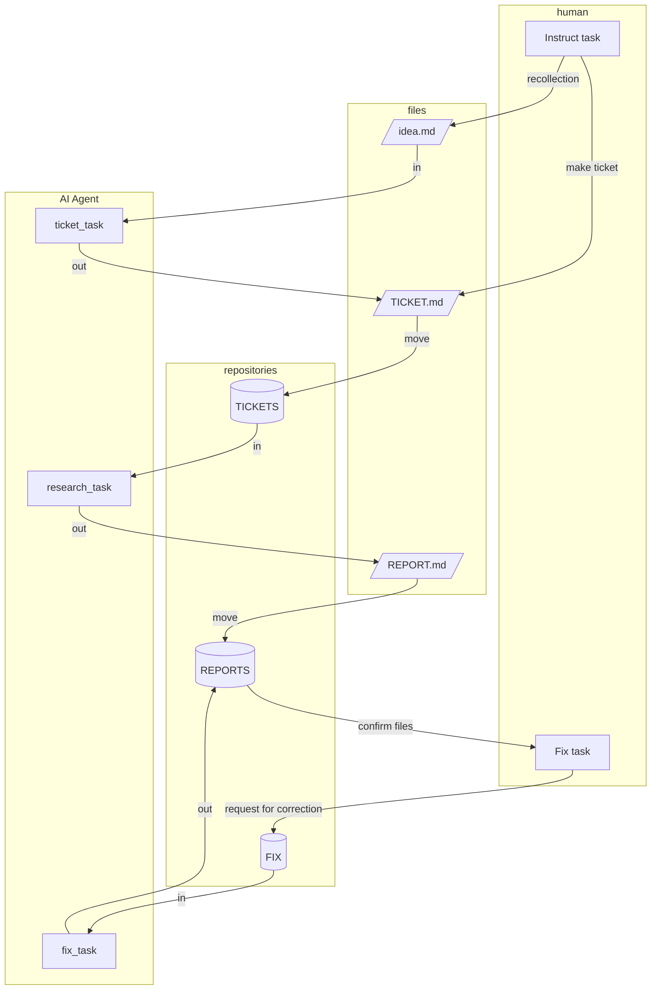

# Repository Overview

This is a comprehensive personal knowledge management repository focused on software engineering, study materials, and project documentation. 
The repository serves as a living knowledge base covering various technology stacks, architectural patterns, development methodologies, and practical guides.

# shortcut Commands
下記のワードが宣言された時は、対応するプロンプトを実行してください。

- **mktickets**: `@WORKS/TASKS/ticketの発行作業.md の内容を理解し、考えて実行してください。`
- **mkreport** : `@WORKS/TASKS/記事の作成作業.md の内容を理解し、考えて実行してください。`
- **fixreport**: `@WORKS/TASKS/ドキュメントの作成作業.md の内容を理解し、考えて実行してください。`

# ドキュメント作成のアーキテクチャ
テキストベースのファイルで指示や成果物を管理することでAI Agentが非同期でタスクを実行できるように設計する.
人が可読,編集な可能な`markdownファイル`を用いることで一人による介入を容易なものとする．

## Abstraction and Definition
ドキュメント作成のタスクを抽象化する
AI Agent に任せることができると予想

1. human_task: アイディアから内を書くかを想起する．(人間)
1. ticket_task: 想起した内容からどのうなドキュメントを作るか考慮
1. research_task: 形式にのっとって調査し成果物としてドキュメントを生成
1. human_fix_task: 成果物を確認し修正指示
1. fix_task: 完成した成果物の校正を繰り返し，完成度を上げる

- アイディア : idea.md
- 作業指示ファイル : ticket.md
- 成果物 : report.md

## Architecture of Documents Making  System

