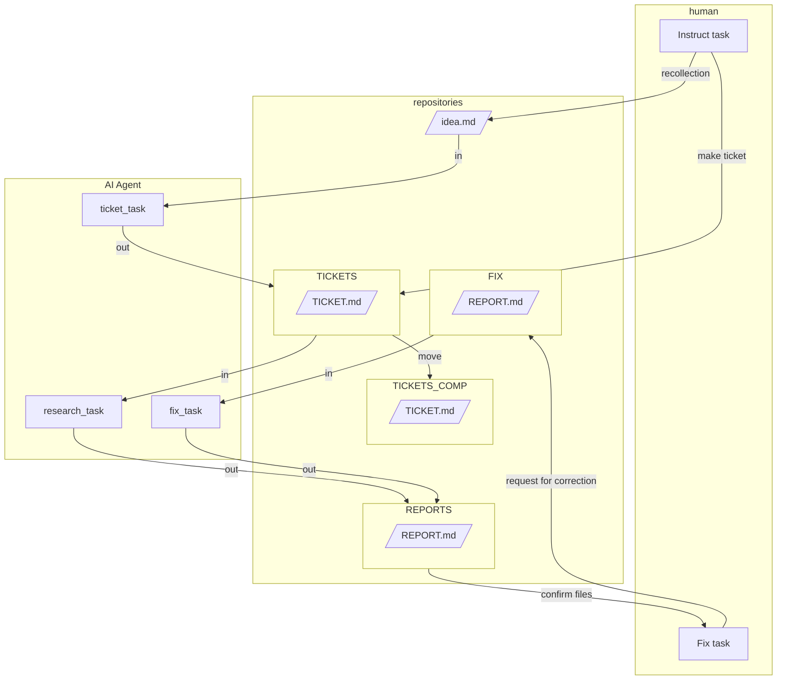

# Architecture of a Document Creation System

This project introduces a document creation system based on **Ticket AI-Driven Development (tentative name)**, utilizing CLI-based agent AI such as **ClaudeCode** and **GeminiCLI**.

# Quick Start

## For GeminiCLI

1.  If you have an idea, jot it down in `[@WORKS/idea.md](/WORKS/idea.md)`.
2.  If you lack knowledge on a topic, write a general instruction in `[@WORKS/idea.md](/WORKS/idea.md)`.
3.  Type **mktickets** in your terminal to generate a ticket file.
4.  If you have a clear idea of the content, you can create a ticket file yourself in `@WORKS/TICKETS`.
5.  Type **mkreport** in your terminal to execute article creation. The AI will consume tickets and create documents sequentially.
6.  Review the document. If corrections are needed, embed `<TODO>Correction details</TODO>` and move the document to the `@WORKS/FIX` directory.
7.  Type **fixreport** in your terminal to execute the correction task.

## For ClaudeCode

1.  If you have an idea, jot it down in `[@WORKS/idea.md](/WORKS/idea.md)`.
2.  If you lack knowledge on a topic, write a general instruction in `[@WORKS/idea.md](/WORKS/idea.md)`.
3.  Use the **/mktickets** command to generate a ticket file.
4.  If you have a clear idea of the content, you can create a ticket file yourself in `@WORKS/TICKETS`.
5.  Execute the **/mkreport** command. The AI will consume tickets and create documents sequentially.
6.  Review the document. If corrections are needed, embed `<TODO>Correction details</TODO>` and move the document to the `@WORKS/FIX` directory.
7.  Execute the **/fixreport** command.

## Abstract

This system is designed to allow AI agents to execute tasks asynchronously by managing instructions and deliverables in text files. Using human-readable and editable Markdown files facilitates individual intervention.

## Abstraction and Definition

The tasks expected to be handled by the AI agent are as follows:

1.  **Human Task**: Conceive content from an idea (Human).
2.  **Ticket Task**: Consider what kind of document to create based on the conceived content.
3.  **Research Task**: Investigate according to a defined format and generate a document as a deliverable.
4.  **Human Fix Task**: Review the deliverable and instruct corrections.
5.  **Fix Task**: Repeatedly proofread the completed deliverable to improve its quality.

*   **Idea**: idea.md
*   **Work Instruction File**: ticket.md
*   **Deliverable**: report.md

## Architecture of Documents Making System



## Design Points

*   Separating ticket issuance and execution allows for human confirmation and intervention.
*   Tickets can be issued by either humans or agents.
*   Keeping used tickets enhances reusability.
*   Keeping tickets allows for checking and improving the accuracy of prompts.
*   Correction tasks can be individually instructed within the deliverable file, simplifying the prompt.
*   Eliminates the need to write prompts at the time of execution.

## Execute Methods

Add the following to a base context file like `GEMINI.md`.
For **ClaudeCode**, creating a custom slash command to execute the following is convenient.

GEMINI.md

```md
### shortcut prompts
When the following words are declared, execute the corresponding prompt.

- **mktickets**: `Understand and execute the contents of @WORKS/TASKS/issue_ticket.md.`
- **mkreport**: `Understand and execute the contents of @WORKS/TASKS/create_document.md.`
- **fixreport**: `Understand and execute the contents of @WORKS/TASKS/fix_document.md.`
```

@WORK/TASKSのファイル名を英語に変更し、変更に合わせて　@README.md, @README.md, @.claude の中のファイルのパスを修正しておいて 