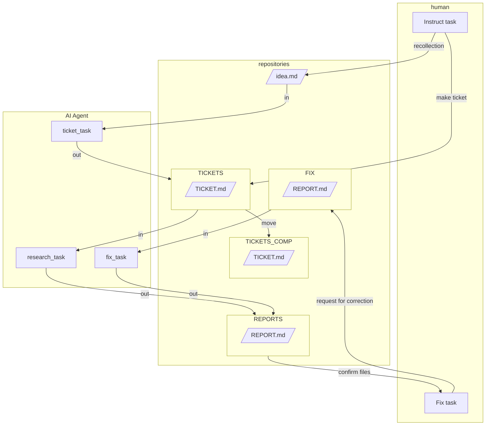

# Document Creation System Using AI Agents
Based on **Ticket AI Driven Development (Tentative)**, we have developed a document creation system using **agent-type AI** in CLIs such as **ClaudeCode** and **GeminiCLI**.
[日本語](README_JP.md)
# Quick Start
## For GeminiCLI
1. Whenever you have an idea, make a note in [@WORKS/idea.md](/WORKS/idea.md).
2. If you lack knowledge, you can also write a rough instruction in [@WORKS/idea.md](/WORKS/idea.md).
3. Type **mktickets** in the terminal to generate ticket files.
4. If you have a general idea of what you want to write, you may generate ticket files in @WORKS/TICKETS yourself.
5. Type **mkreport** in the terminal to execute article creation. The AI will consume tickets and create documents one after another.
6. Review the documents, and if revisions are needed, embed `<TODO>revisions</TODO>` and move the documents to the @WORKS/FIX directory.
7. Type **fixreport** in the terminal to execute article creation.
## For ClaudeCode
1. Whenever you have an idea, make a note in [@WORKS/idea.md](/WORKS/idea.md).
2. If you lack knowledge, you can also write a rough instruction in [@WORKS/idea.md](/WORKS/idea.md).
3. Use the **/mktickets** command to generate ticket files.
4. If you have a general idea of what you want to write, you may generate ticket files in @WORKS/TICKETS yourself.
5. Execute the **/mkreport** command. The AI will consume tickets and create documents one after another.
6. Review the documents, and if revisions are needed, embed `<TODO>revisions</TODO>` and move the documents to the @WORKS/FIX directory.
7. Execute the **/fixreport** command.

# Abstract
By managing instructions and deliverables with text files, the system is designed for humans and AI agents to execute tasks asynchronously.
## Abstraction and Definition
The tasks that can be expected to be handled by AI agents are as follows:
1. **Human Task**: Recall content from ideas (human).
2. **Ticket Task**: Consider what kind of document to create from the recalled content.
3. **Research Task**: Conduct research according to a specified format and generate documents as deliverables.
4. **Human Fix Task**: Review deliverables and issue correction instructions.
5. **Fix Task**: Continuously proofread the completed deliverables to enhance quality.
<!-- end list -->
  * **Ideas**: idea.md
  * **Work Instruction Files**: ticket.md
  * **Deliverables**: report.md
## Architecture of Document Making System

## Design Points
  * The prompts allow asynchronous task execution between AI agents and humans through markdown files.
  * By separating ticket issuance and execution tasks, human review and intervention are possible.
  * Ticket issuance can be performed by either humans or agents.
  * Retaining the used tickets enhances reusability.
  * Retaining the used tickets allows for checking and improving the accuracy of prompts.
  * The revision work can be instructed individually within the deliverable files, simplifying prompt input to the terminal.
  * It eliminates the need to write prompts to the terminal during execution.

# FAQ
## Is it okay to add a template for the ticket file?
1. You can create your own ticket file template in any location. A sample is available in @WORKS/TICKETS/_temp.
2. Edit [issue_ticket.md](./WORKS/TASKS/issue_ticket.md) and provide a path to the ticket file you created.
## How can I change the content of the ticket file template?
1. Check the third line of [issue_ticket.md](./WORKS/TASKS/issue_ticket.md) to see which file is being referenced.
2. Edit the referenced sample.md.
## How can I add more types of tasks?
1. Create your own task file template in any location. The default location is @WORKS/TICKETS.
2. If you are using GeminiCLI, edit [GEMINI.md](GEMINI.md) to set up shortcuts for executing the task files.
3. If you are using ClaudeCode, create a custom slash command to execute the task file in `.claude/commands`.
## How can I adjust the contents of a task?
1. Edit the relevant task file located in @WORKS/TICKETS.
2. If you change the task file name and are using GeminiCLI, edit [GEMINI.md](GEMINI.md).
3. If you change the task file name and are using ClaudeCode, edit the custom slash command for the corresponding task in `.claude/commands`.
