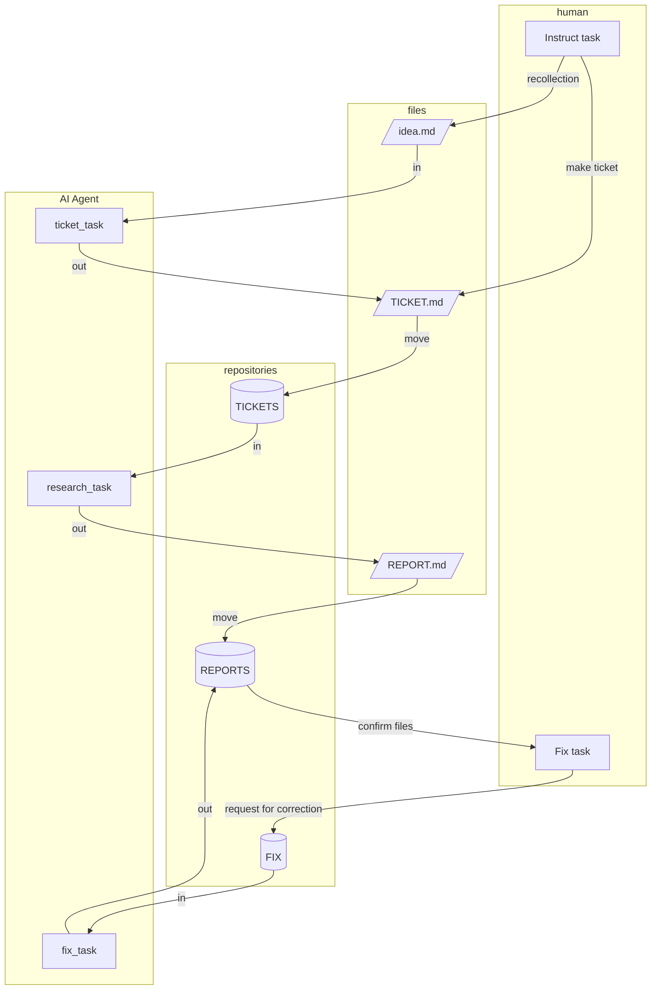

## Introduction
This system is designed to allow AI Agents to execute tasks asynchronously by managing instructions and deliverables in text-based files. By using human-readable and editable `markdown files`, it facilitates easy human intervention.

## Abstraction and Definition
Abstracting the task of document creation.
Expected to be handled by AI Agents.

1. human_task: Recall what to write from an idea. (Human)
1. ticket_task: Consider what kind of document to create based on the recalled content.
1. research_task: Research and generate the document as a deliverable according to the format.
1. human_fix_task: Review the deliverable and provide correction instructions.
1. fix_task: Repeatedly proofread the completed deliverable to improve its quality.

- Idea: idea.md
- Work instruction file: ticket.md
- Deliverable: report.md

## Architecture of Documents Making System



## Execute Methods
Add the following to a base context file such as `GEMINI.md`.
For `ClaudeCode`, creating a custom slash command is convenient.

GEMINI.md
```md
## shortcut prompts
When the following words are declared, execute the corresponding prompt.

- **mktickets**: `Understand and execute the contents of @WORKS/TASKS/ticketの発行作業.md.`
- **mkreport** : `Understand and execute the contents of @WORKS/TASKS/記事の作成作業.md.`
- **fixreport**: `Understand and execute the contents of @WORKS/TASKS/ドキュメントの作成作業.md.`
```

## Operation

1. Whenever you come up with an idea, jot it down.
1. If you are unsure, give rough instructions in `idea.md` and have a ticket file generated.
1. If you already know what you want to write, create the ticket file yourself.
1. Execute. The AI consumes tickets and keeps generating documents.
1. If you want corrections, embed </TODO> and move the document to FIX to request revisions.

