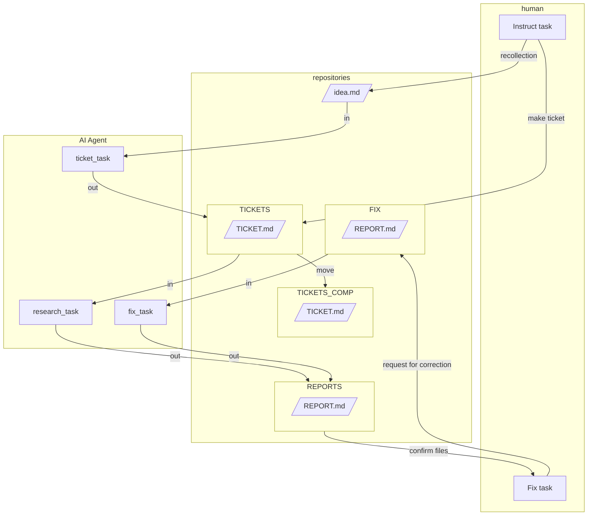

# AIエージェントを使ったドキュメント作成システム

**チケットAI駆動開発(仮)**を基に、**ClaudeCode**や**GeminiCLI**をはじめとするCLIの**エージェント型AI**を用いたドキュメント作成システムを制作しました。

[English](README.md)

# Quick Start
## GeminiCLIの場合
1.  何か思いついたら [@WORKS/idea.md](/WORKS/idea.md) に大まかな指示を記述します.
1. **mktickets**　とターミナルに打ってチケットファイルを生成してもらいます。
1.  ある程度書きたい内容が決まっている場合は、自分で　@WORKS/TICKETS　にチケットファイルを生成しても構いません
1.  **mkreport**　とターミナルに打って記事作成を実行します。AIはチケットを消費して、ドキュメントを次々と作成します。
1.  ドキュメントを確認し、修正が必要な場合は`<TODO>修正内容</TODO>`を埋め込み、@WORKS/FIX ディレクトリにドキュメントを移動させます。
1.  **fixreport**　とターミナルに打って記事作成を実行します。
## ClaudeCodeの場合
1.  何か思いついたら [@WORKS/idea.md](/WORKS/idea.md) に大まかな指示を記述します.
1. **/mktickets**　コマンドでチケットファイルを生成してもらいます。
1.  ある程度書きたい内容が決まっている場合は、自分で　@WORKS/TICKETS　にチケットファイルを生成しても構いません
1.  **/mkreport**　コマンドを実行します。AIはチケットを消費して、ドキュメントを次々と作成します。
1.  ドキュメントを確認し、修正が必要な場合は`<TODO>修正内容</TODO>`を埋め込み、@WORKS/FIX ディレクトリにドキュメントを移動させます。
1.  **/fixreport**　コマンドを実行します。

## スニペット設定
VSCodeなどスニペットが使用できる場合はmarkdownのスニペットを使用すると便利です．

```json
// markdown.json
{
    "AI指示用ののtodoタグをつける": {
        "prefix": "todo_ai",
        "body": [
            "<TODO>$1</TODO>"
        ],
        "description": "TODO Tag for AI Agent."
    }
}
```

なお VSCodeで markdownのスニペットを利用するには `.vscode/settings.json`の編集が必要です．

```json
// settings.json
{
    "[markdown]": {
    "editor.quickSuggestions": {
        "comments": "on",
        "strings": "on",
        "other": "on"
    },
    }
}

```

# Abstract

Web調査レポートや要件書などのビジネスシーンで使用するドキュメント生成する仕事を人とAIエージェントが非同期でタスクを実行できる環境を構築します．


## Abstraction
AIエージェントに任せられると予想されるタスクを抽象化します．

1.  **Human Task**: アイデアから内容を想起する（人間）。
2.  **Ticket Task**: 想起した内容から、どのようなドキュメントを作成するか検討する。
3.  **Research Task**: 定められた形式に沿って調査し、成果物としてドキュメントを生成する。
4.  **Human Fix Task**: 成果物を確認し、修正を指示する。
5.  **Fix Task**: 完成した成果物の校正を繰り返し行い、完成度を高める。

## Definition

* **アイデア**: idea.md
* **作業指示ファイル**: ticket.md
* **成果物**: report.md

## Architecture of Documents Making System



## 設計のポイント
  * プロンプトをmarkdownファイルを介してAIエージェントと人が非同期でタスクを実行できるようにします.
  * チケット発行作業と実行作業を分けることで、人が確認・介入できるようにします。
  * チケット発行は、人でもエージェントでも行うことが可能です。
  * 使用したチケットを残しておくことで、再利用性を高めます。
  * 使用したチケットを残しておくことで、プロンプトの精度を確認し、改善できます。
  * 修正作業は成果物ファイル内で個別に指示できるようにし、ターミナルへのプロンプト入力を簡略化します。
  * 実行時にターミナルへプロンプトを記述する必要がないようにします。

# FAQ

## ticketファイルのテンプレート追加したい場合はよいですか．
1. 任意の場所にご自身でticketファイルのテンプレートを作成します．@WORKS/TICKETS/_temp 内にサンプルがあります．
1. [issue_ticket.md](./WORKS/TASKS/issue_ticket.md) を編集し，ご自身が作成したticketファイルへパスを通してください．

## ticketファイルのテンプレートの内容を変更するにはどうすればよいですか．
1. [issue_ticket.md](./WORKS/TASKS/issue_ticket.md) の3行目を確認し，どのファイルを参照しているか確認します．
1. 参照もとのsample.mdを編集します．

## taskの種類を追加したいのですがどうすればよいですか．
1. 任意の場所にご自身でtaskファイルのテンプレートを作成します．デフォルトは @WORKS/TICKETS です．
1. GeminiCLIをご使用の場合は [GEMINI.md](GEMINI.md) を編集し，taskファイルを実行するショートカットを設定します．
1. ClaudeCodeをご使用の場合は `.claude/commands` へtaskファイルを実行するカスタムシュラッシュコマンドを作成します．

## taskの内容を調整したい場合はどうすればいいですか
1. @WORKS/TICKETS 内に入っている該当する taskファイルを編集してください．
1. もし，taskファイル名を変更し，GeminiCLIをご使用の場合は [GEMINI.md](GEMINI.md) を編集ししてください．
1. もし，taskファイル名を変更し，ClaudeCodeをご使用の場合は `.claude/commands` の該当するタスクのカスタムシュラッシュコマンドを編集してください．
