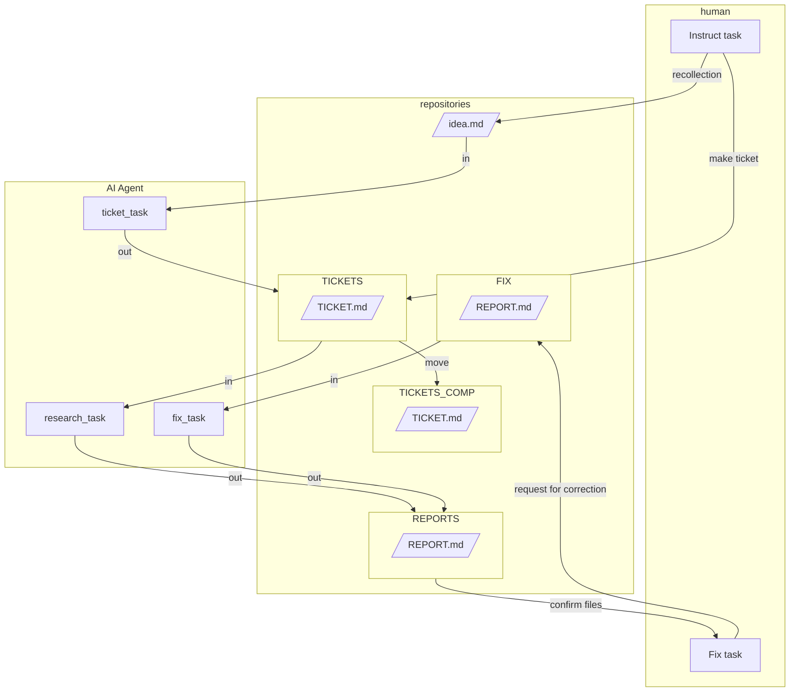

# ドキュメント作成システムのアーキテクチャを作ってみる

\*\*チケットAI駆動開発（仮称）\*\*を基に、**ClaudeCode**や**GeminiCLI**をはじめとするCLIの**エージェント型AI**を用いたドキュメント作成システムを制作しました。


# Quick Start
## GeminiCLIの場合
1.  何か思いついたら [@WORKS/idea.md](/WORKS/idea.md) にメモしておきます。
1.  また、知識がない場合も [@WORKS/idea.md](/WORKS/idea.md) に に大まかな指示を記述します。
1. **mktickets**　とターミナルに打ってチケットファイルを生成してもらいます。
1.  ある程度書きたい内容が決まっている場合は、自分で　@WORKS/TICKETS　にチケットファイルを生成しても構いません
1.  **mkreport**　とターミナルに打って記事作成を実行します。AIはチケットを消費して、ドキュメントを次々と作成します。
1.  ドキュメントを確認し、修正が必要な場合は`<TODO>修正内容</TODO>`を埋め込み、@WORKS/FIX ディレクトリにドキュメントを移動させます。
1.  **fixreport**　とターミナルに打って記事作成を実行します。
## ClaudeCodeの場合
1.  何か思いついたら [@WORKS/idea.md](/WORKS/idea.md) にメモしておきます。
1.  また、知識がない場合も [@WORKS/idea.md](/WORKS/idea.md) に に大まかな指示を記述します。
1. **/mktickets**　コマンドでチケットファイルを生成してもらいます。
1.  ある程度書きたい内容が決まっている場合は、自分で　@WORKS/TICKETS　にチケットファイルを生成しても構いません
1.  **/mkreport**　コマンドを実行します。AIはチケットを消費して、ドキュメントを次々と作成します。
1.  ドキュメントを確認し、修正が必要な場合は`<TODO>修正内容</TODO>`を埋め込み、@WORKS/FIX ディレクトリにドキュメントを移動させます。
1.  **/fixreport**　コマンドを実行します。

# Abstract

テキストファイルで指示や成果物を管理することで、AIエージェントが非同期でタスクを実行できるように設計します。人が可読・編集可能なMarkdownファイルを用いることで、個人の介入を容易にします。

## Abstraction and Definition

AIエージェントに任せられると予想されるタスクは以下の通りです。

1.  **Human Task**: アイデアから内容を想起する（人間）。
2.  **Ticket Task**: 想起した内容から、どのようなドキュメントを作成するか検討する。
3.  **Research Task**: 定められた形式に沿って調査し、成果物としてドキュメントを生成する。
4.  **Human Fix Task**: 成果物を確認し、修正を指示する。
5.  **Fix Task**: 完成した成果物の校正を繰り返し行い、完成度を高める。

<!-- end list -->

  * **アイデア**: idea.md
  * **作業指示ファイル**: ticket.md
  * **成果物**: report.md

## Architecture of Documents Making System



## 設計のポイント

  * チケット発行作業と実行作業を分けることで、人が確認・介入できるようにします。
  * チケット発行は、人でもエージェントでも行うことが可能です。
  * 使用したチケットを残しておくことで、再利用性を高めます。
  * チケットを残しておくことで、プロンプトの精度を確認し、改善できます。
  * 修正作業は成果物ファイル内で個別に指示できるようにし、プロンプトは簡略化します。
  * 実行時にプロンプトを記述する必要がないようにします。

## Execute Methods

下記を `GEMINI.md` のような基底コンテキストファイルに入れます。
**ClaudeCode**の場合は下記を実行するカスタムシュラッシュを作ると快適です。

GEMINI.md

```md
### shortcut prompts
下記のワードが宣言された場合、対応するプロンプトを実行してください。

- **mktickets**: `Understand and execute the contents of @WORKS/TASKS/issue_ticket.md.`
- **mkreport**: `Understand and execute the contents of @WORKS/TASKS/create_document.md.`
- **fixreport**: `Understand and execute the contents of @WORKS/TASKS/fix_document.md.`
```
