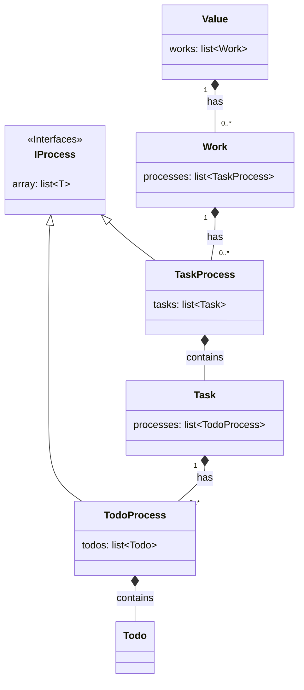
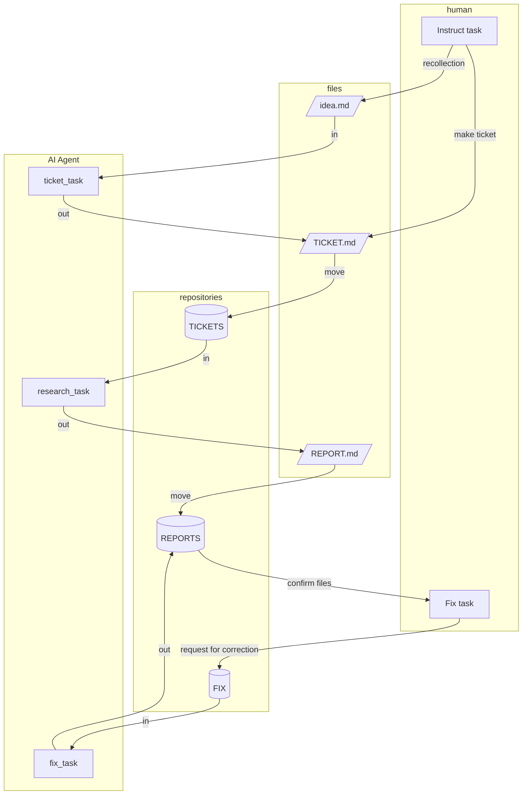

# エージェント型AI(ClaudeCode, GeminiCLIなど)を用いた開発環境について
最近、 `ClaudeCode` を始めてとするエージェント型のAIが流行っている。
巷では、非エンジニアや全くコードをかけなくてもソフトウェアが作れると言われている。
VibeCodingなる概念の登場で、プログラマーはもう不要という意見も聞こえる。
半信半疑で実際に触ってみた感想をまとめたいと思う。

# 人間とエージェント型AIとどうやって協調してくか
結論から言うと、私の言語能力ではすべてのコーディングをエージェント型AIにを任せて、
満足いく品質のソフトウェアを作ることはできなかった。

LLMのモデル自体の精度はチャット型のAIと大差ないという印象だった。
結局,エージェント型になろうが、与えられたコンテキスト内の中央値しか出力できないというのは変わらないという感想だ。

では、エージェント型がチャット型と異なって優れているのは何だろうか。

それは、大きくはファイルIOやコマンド実行できる点だと思う．
チャット型ではできなかったいろいろな処理が考えられる。

- プロンプトをテキストファイルとして構造化，定型化しすることで再利用性が高い。
- 指示中にファイルの内容を読ませれば、複数かつ複雑なコンテキストを与えることができる。
- アウトプットをファイルとして残すことができる。gitなどバージョン管理できる。
- アウトプットを指示が書かれたファイルにすれば、そのアウトプットをもとにタスクを実行でき、パイプライン処理できる。
- 排他を考えれば非同期でタスクをこなすことが出来る。

このファイルを扱えるという特徴を使って、うまくエージェント型AIと仕事を分け合って協調することができれば、
効率を上げることが出来ると思われる。

そこで次は、まずは我々が普段やっていた仕事を抽象化したうえで、
エージェント型を効率的に使用するシステムアーキテクチャを考えるものとする。


# 仕事の抽象化
まずは我々の仕事というのを抽象化する．

```py

class Todo:
    """タスクの要素。作業最小単位"""

class IProcess:
    """処理順番"""
    array: list[T]

class TodoProcess(IProcess):
    """todoの処理順番"""
    todos: list[Todo]

class Task:
    """仕事をなすべき構成要素。達成すべき課題。"""
    processes : list[TodoProcess]
   

class TaskProcess(IProcess):
    """taskの処理順番"""
    tasks: list[Task]


class Work:
    """valueを生む仕事。人の欲求によりエネルギー不均衡が生まれ、エントロピーが拡散する際に仕事になるイメージ。"""
    processes : list[TaskProcess]
  

class Value:
    """人が主観的に価値があると思うもの。欲求といってもいい。エネルギー不均衡を生むイメージ"""
    works: list[Work]
```

クラス図でかくと．



我々の仕事というものはいくつかのnode(task)に分解され、それぞれのnodeのタスクの中に細かいnode(node)がある。
node間に依存関係があるものは、前のnodeが完了しないと、次のnodeが実行できない。
この関係性をprocessとして定義できる。

# エージェント型AIを使った開発システムのアーキテクチャ
抽象化の結果，タスクをどうやって AI Agentに実行させるか考える．

- 我々が仕事を行う上では何らかの目的があるとする．
- 目的にって生まれる価値があると仮定する．
- この価値を生むためのミッションが定義される．
- このミッションに基づいて，各個人が何をするかタスクを考える．
- この際の最小タスクを言語化したものをチケットとする．
- チケットをAIエージェントにコンテキストとして与える．
- チケットを作成するチケットを作成し，そのチケットを処理することもできる
- エージェントは与えられたコンテキストの範囲内でTODOを考え実行する．
- アウトプットが非同期で次々と完成する
- 人間はアプトプットを確認する．

```mermaide

graph TD
    
    values["CORE VALUES"]
    subgraph WORKS
        subgraph human
            task_0["TASK"]
            task_1["TASK"]
            task_confirm["TASK"]

        end

        subgraph repositories

            ticket_0[/"TICKET.md"/]
            ticket_1[/"TICKET.md"/]
            ticket_2[/"TICKET.md"/]
        end

        subgraph ai["AI Agent"]
            AgentAI_0["TASK"]
            AgentAI_1["TASK"]
            AgentAI_2["TASK"]

            TODO_0["TODOs"]
            TODO_1["TODOs"]
            TODO_2["TODOs"]
        end 

        log["OUT_PUTs"]
       
    end

      

        values --recall--> WORKS
        task_0 --"make"--> ticket_0
        ticket_0 --"in"--> AgentAI_0
        AgentAI_0 --> TODO_0


        task_1 --"make"--> ticket_1
        ticket_1 --"in"--> AgentAI_1
        AgentAI_1 --> TODO_1

        ticket_2 --"in"--> AgentAI_2
        AgentAI_2 --> TODO_2

        TODO_0 --"out"--> log
        TODO_2 --"out"--> log
        TODO_1 --"out"--> ticket_2
        task_confirm --"confirm"--> log

```


# 具体例：ドキュメント作成システムのアーキテクチャ
考えを元に ドキュメントを作成するシステム の具体例を考えてみた．

## Introduction
テキストベースのファイルで指示や成果物を管理することでAI Agentが非同期でタスクを実行できるように設計する.
人が可読,編集な可能な`markdownファイル`を用いることで一人による介入を容易なものとする．

## Abstraction and Definition
ドキュメント作成のタスクを抽象化する
AI Agent に任せることができると予想

1. human_task: アイディアから内を書くかを想起する．(人間)
1. ticket_task: 想起した内容からどのうなドキュメントを作るか考慮
1. research_task: 形式にのっとって調査し成果物としてドキュメントを生成
1. human_fix_task: 成果物を確認し修正指示
1. fix_task: 完成した成果物の校正を繰り返し，完成度を上げる

- アイディア : idea.md
- 作業指示ファイル : ticket.md
- 成果物 : report.md

## Architecture of Documents Making  System



## Execute Methods
下記を `GEMINI.md `のような 基底コンテキストファイルに入れる．
`ClaudeCode` の場合は カスタムシュラッシュを作ると快適．

GEMINI.md
```md
## shortcut prompts
下記のワードが宣言された時は、対応するプロンプトを実行してください。

- **mktickets**: `@WORKS/TASKS/ticketの発行作業.md の内容を理解し、考えて実行してください。`
- **mkreport** : `@WORKS/TASKS/記事の作成作業.md の内容を理解し、考えて実行してください。`
- **fixreport**: `@WORKS/TASKS/ドキュメントの作成作業.md の内容を理解し、考えて実行してください。`
```

## 運用

1. 何か思いついたらアイディアをメモっておく
1. 無知の場合は`idea.md`にざっくりした指示をして ticketファイルを生成してもらう
1. ある程度書かせたいものが決まっている場合は 自分で ticketファイルを生成する
1. 実行する．AIはチケットを消費して，ドキュメントをどんどん作る．
1. 確認して，修正してほしい場合は </TODO> を埋め込み FIXにドキュメントを移し，修正を依頼する


# 運用してみた感想
このシステムを使って、後で調べようとか、調べるのめんどくさく敬遠していたことでも、思い付きでレポートとして出力できるようになった。
正直、レポートが生成されるのが早すぎて読むのが追い付かないほどだ。
ここで作った文章をそのまま、公開するには少し品質が劣るが、多少手直しすれば、公開なレベルである。


# 応用について
今回はドキュメント作成について具体

# 評価をどうするのか問題
エージェント自身やエージェントが使うモデルを正しく評価しているものがあまり見られない

- 再現性: 同じプロンプトで同じ結果が得られるか
- 正確性: 期待通りの結果が得られるか
- 処理速度: タスク実行にかかる時間
- コスト: タスクを実行にかかる金銭的なコスト
- コンテキストの量: 
- 長期記憶: 
- token: 

実験した条件によって結果が変わることもある．
なので大事なのは，どういった条件，方法で実験をし，どのような結果を得たかを残し，蓄積する必要がある．
科学的なアプローチというのは時間がかかるが，間違いを認め，是正できるといういみで優れている．

